# Isaac-GR00T 双臂5指灵巧手抓取全流程工作指南

> **使用Isaac-GR00T N1.5模型进行宇树机器人双臂5指灵巧手抓取任务**

## 📋 目录

1. [概述](#概述)
2. [环境准备](#环境准备)
3. [完整工作流程](#完整工作流程)
4. [详细步骤](#详细步骤)
5. [故障排查](#故障排查)

---

## 概述

本指南介绍如何使用**Isaac-GR00T N1.5**模型完成宇树机器人双臂5指灵巧手抓取任务的全流程，包括：

- ✅ 仿真环境搭建
- ✅ 数据采集（遥操作）
- ✅ 数据预处理
- ✅ GR00T模型微调
- ✅ 模型评估
- ✅ 模型转换（ONNX）
- ✅ 仿真测试
- ✅ 真机部署

---

## 环境准备

### 1. 安装Isaac Sim和Isaac Lab

参考项目README中的安装指南：
- [Isaac Sim 4.5 安装](doc/isaacsim4.5_install_zh.md)
- [Isaac Sim 5.0 安装](doc/isaacsim5.0_install_zh.md)

### 2. 安装Isaac-GR00T

```bash
# 克隆Isaac-GR00T仓库
git clone https://github.com/NVIDIA/Isaac-GR00T.git
cd Isaac-GR00T

# 按照官方文档安装
# 参考: https://github.com/NVIDIA/Isaac-GR00T
pip install -r requirements.txt
```

### 3. 安装项目依赖

```bash
cd /workspace
pip install -r requirements.txt
. fetch_assets.sh
```

---

## 完整工作流程

```mermaid
graph LR
    A[1. 仿真环境] --> B[2. 数据采集]
    B --> C[3. 数据预处理]
    C --> D[4. GR00T微调]
    D --> E[5. 模型评估]
    E --> F[6. ONNX转换]
    F --> G[7. 仿真测试]
    G --> H{效果满意?}
    H -->|否| D
    H -->|是| I[8. 真机部署]
```



---

## 详细步骤

### 步骤1: 启动仿真环境

```bash
# 启动G1机器人 + Inspire 5指灵巧手抓取圆柱体任务
python sim_main.py \
  --device cuda \
  --enable_cameras \
  --task Isaac-PickPlace-Cylinder-G129-Inspire-Joint \
  --enable_inspire_dds \
  --robot_type g129
```

**说明:**
- `--task`: 任务名称，支持的任务见项目README
- `--enable_inspire_dds`: 启用Inspire 5指灵巧手DDS通信
- `--robot_type`: 机器人类型 (g129, h1_2)

### 步骤2: 数据采集（遥操作）

配合 [xr_teleoperate](https://github.com/unitreerobotics/xr_teleoperate) 项目进行数据采集。

**终端1: 启动仿真**
```bash
python sim_main.py --task Isaac-PickPlace-Cylinder-G129-Inspire-Joint \
  --enable_inspire_dds --robot_type g129
```

**终端2: 启动遥操作**
```bash
cd /path/to/xr_teleoperate
python teleop_main.py --robot g1 --effector inspire
```

**数据采集建议:**
- 采集20-50个成功的演示episode
- 每个episode包含完整的抓取-放置流程
- 确保数据多样性（不同物体位置、姿态）

### 步骤3: 数据预处理

```bash
# 使用数据预处理脚本
python training/data_preprocessing.py \
  --data_dirs "./teleoperate_data/episode_001,./teleoperate_data/episode_002,..." \
  --output_dir "./processed_data" \
  --train_ratio 0.8 \
  --normalize
```

**输出结构:**
```
processed_data/
├── train/
│   ├── episode_001/
│   │   ├── states.npy
│   │   ├── actions.npy
│   │   └── images/  # 如果使用图像
│   └── ...
└── val/
    └── ...
```

### 步骤4: GR00T模型微调

#### 4.1 准备配置文件

编辑 `configs/gr00t_finetune.yaml`:

```yaml
model:
  model_name: "gr00t_n1.5"
  pretrained_checkpoint: null  # null表示从官方仓库下载
  freeze_backbone: false  # false=端到端微调, true=只微调输出层

training:
  epochs: 50
  batch_size: 32
  learning_rate: 1e-4  # 微调使用较小学习率
  ...
```

#### 4.2 开始微调

```bash
python gr00t/train_gr00t.py \
  --config configs/gr00t_finetune.yaml \
  --data_dir ./processed_data \
  --output_dir ./models/gr00t_finetuned \
  --pretrained_checkpoint null \
  --freeze_backbone false
```

**训练选项:**
- `--freeze_backbone true`: 只微调输出层（更快，适合数据少的情况）
- `--freeze_backbone false`: 端到端微调（效果更好，需要更多数据）

**训练输出:**
```
models/gr00t_finetuned/
├── latest_checkpoint.pth
├── best_model.pth
├── training_history.json
└── ...
```

### 步骤5: 模型评估

```bash
# 在仿真环境中评估模型
python sim_main.py \
  --task Isaac-PickPlace-Cylinder-G129-Inspire-Joint \
  --action_source policy \
  --model_path ./models/gr00t_finetuned/best_model.pth \
  --enable_inspire_dds \
  --robot_type g129
```

### 步骤6: 转换为ONNX格式

```bash
python gr00t/convert_to_onnx.py \
  --checkpoint ./models/gr00t_finetuned/best_model.pth \
  --output ./models/gr00t_finetuned/model.onnx \
  --state_dim 512 \
  --batch_size 1
```

### 步骤7: 仿真测试（使用ONNX模型）

```bash
python sim_main.py \
  --task Isaac-PickPlace-Cylinder-G129-Inspire-Joint \
  --action_source policy \
  --model_path ./models/gr00t_finetuned/model.onnx \
  --enable_inspire_dds \
  --robot_type g129
```

### 步骤8: 真机部署

```bash
python gr00t/deploy_gr00t.py \
  --model_path ./models/gr00t_finetuned/model.onnx \
  --robot_type g1 \
  --robot_ip 192.168.123.10 \
  --effector inspire \
  --use_onnx \
  --safety_mode \
  --frequency 50.0
```

**部署参数:**
- `--robot_ip`: 机器人IP地址
- `--safety_mode`: 启用安全模式（限制动作变化和范围）
- `--frequency`: 控制频率（Hz）

---

## 快速开始脚本

### 端到端工作流程

```bash
# 使用完整工作流程脚本
./scripts/gr00t_end_to_end.sh \
  --robot-type g1 \
  --effector inspire \
  --task Isaac-PickPlace-Cylinder-G129-Inspire-Joint \
  --data-dir ./teleoperate_data \
  --epochs 50
```

---

## 故障排查

### 1. GR00T模型加载失败

**问题:** 无法加载GR00T预训练模型

**解决方案:**
```bash
# 检查是否安装了Isaac-GR00T
pip list | grep gr00t

# 如果未安装，参考官方文档安装
# https://github.com/NVIDIA/Isaac-GR00T
```

### 2. 内存不足

**问题:** GPU内存不足导致训练失败

**解决方案:**
- 减小batch_size（在配置文件中）
- 使用`freeze_backbone=true`只微调输出层
- 使用梯度累积

### 3. 动作维度不匹配

**问题:** 模型输出维度与机器人动作维度不匹配

**解决方案:**
- 检查机器人配置（G1 29DOF + Inspire 24DOF = 53维）
- 模型会自动替换输出层以适应新的动作空间

### 4. DDS通信失败

**问题:** 无法连接到真实机器人

**解决方案:**
```bash
# 检查DDS配置
export CYCLONEDDS_URI='<CycloneDDS><Domain><Id>1</Id></Domain></CycloneDDS>'

# 检查网络连接
ping <robot_ip>
```

---

## 性能优化建议

### 1. 数据采集
- 采集多样化的演示数据
- 确保数据质量（成功的演示）
- 建议20-50个episode

### 2. 微调策略
- **数据少 (<20 episodes)**: 使用`freeze_backbone=true`
- **数据多 (>30 episodes)**: 使用`freeze_backbone=false`端到端微调
- 学习率建议: 1e-4 ~ 5e-5

### 3. 部署优化
- 使用ONNX格式进行部署（更快）
- 启用安全模式保护机器人
- 控制频率建议: 50 Hz

---

## 参考资源

- [Isaac-GR00T官方仓库](https://github.com/NVIDIA/Isaac-GR00T)
- [宇树机器人SDK](https://github.com/unitreerobotics/unitree_sdk2_python)
- [项目完整工作流程指南](docs/完整工作流程指南.md)

---

## 下一步

完成基础抓取任务后，可以尝试：

1. **更复杂的任务**: 堆叠、抽屉操作等
2. **多物体抓取**: 同时抓取多个物体
3. **动态抓取**: 抓取移动的物体
4. **在线学习**: 在真实机器人上进行在线微调

---

<div align="center">
  <p><strong>祝您使用愉快！</strong></p>
  <p>如有问题，请参考故障排查部分或提交Issue</p>
</div>
