# 🤖 宇树机器人双臂5指灵巧手抓取全流程项目

> **完整的仿真、数据采集、模型训练、微调、部署解决方案**

[](LICENSE)
[](https://www.python.org/)
[](https://developer.nvidia.com/isaac-sim)

---

## 📖 项目简介

本项目基于 **Isaac Lab** 和 **Unitree SDK2**，为宇树人形机器人提供完整的双臂5指灵巧手抓取解决方案。从仿真环境搭建到真机部署，涵盖机器人学习的全流程。

### ✨ 主要特性

- ✅ **完整的仿真环境**：基于 Isaac Lab 的高保真物理仿真
- ✅ **多机器人支持**：G1-29dof、H1-2 人形机器人
- ✅ **多灵巧手支持**：Dex1（2指）、Dex3（3指）、Inspire（5指）
- ✅ **丰富的任务场景**：抓取、放置、堆叠、全身移动等
- ✅ **遥操作数据采集**：支持 VR/XR 遥操作采集专家演示
- ✅ **数据增强**：自动生成多样化训练数据
- ✅ **模型训练**：行为克隆、扩散策略等算法
- ✅ **真机部署**：一键部署到真实机器人
- ✅ **DDS通信**：与真实机器人相同的通信协议

---

## 🚀 快速开始

### 1. 环境安装

```bash
# 方式一：使用现有环境
cd /workspace
pip install -r requirements.txt
. fetch_assets.sh

# 方式二：使用Docker（推荐）
docker build -t unitree-sim:latest -f Dockerfile .
```

### 2. 运行仿真

```bash
# G1机器人 + Inspire灵巧手抓取圆柱体
python sim_main.py \
  --device cuda \
  --enable_cameras \
  --task Isaac-PickPlace-Cylinder-G129-Inspire-Joint \
  --enable_inspire_dds \
  --robot_type g129
```

### 3. 数据采集（配合遥操作）

```bash
# 终端1: 启动仿真
python sim_main.py --task <任务名> --enable_inspire_dds --robot_type g129

# 终端2: 启动遥操作（需要xr_teleoperate项目）
cd /path/to/xr_teleoperate
python teleop_main.py --robot g1 --effector inspire
```

### 4. 快速训练

```bash
# 使用快速训练脚本
./scripts/quick_start_training.sh --data ./teleoperate_data
```

### 5. 端到端工作流程

```bash
# 完整流程：数据采集 → 训练 → 部署
./scripts/end_to_end_workflow.sh
```

---

## 📁 项目结构

```
workspace/
│
├── README.md                          # 原始README
├── 项目总览.md                         # 本文件
├── QUICK_REFERENCE.md                # 快速参考
│
├── docs/                              # 📚 文档目录
│   ├── 完整工作流程指南.md              # 详细工作流程
│   ├── API文档.md                     # API参考文档
│   ├── isaacsim4.5_install.md       # 安装指南
│   └── isaacsim5.0_install.md
│
├── configs/                           # ⚙️ 配置文件
│   ├── bc_inspire_hand.yaml          # 行为克隆训练配置
│   ├── deployment_config.yaml        # 部署配置
│   └── ...
│
├── training/                          # 🎓 训练模块
│   ├── __init__.py
│   ├── data_preprocessing.py         # 数据预处理
│   ├── train_bc.py                   # 行为克隆训练
│   ├── train_diffusion.py            # 扩散策略训练（待实现）
│   └── evaluate.py                   # 模型评估（待实现）
│
├── deployment/                        # 🚀 部署模块
│   ├── __init__.py
│   ├── convert_to_onnx.py            # 模型转换
│   ├── deploy_to_robot.py            # 真机部署
│   └── monitor_robot.py              # 实时监控（待实现）
│
├── scripts/                           # 📜 实用脚本
│   ├── end_to_end_workflow.sh        # 端到端工作流程
│   └── quick_start_training.sh       # 快速训练脚本
│
├── sim_main.py                        # 🎮 仿真主程序
├── data_processor.py                  # 数据处理工具
├── quick_start.py                     # 快速启动脚本
│
├── action_provider/                   # 动作提供者
├── dds/                               # DDS通信
├── image_server/                      # 图像服务
├── layeredcontrol/                    # 控制系统
├── robots/                            # 机器人配置
├── tasks/                             # 任务定义
│   ├── g1_tasks/                     # G1任务
│   ├── h1-2_tasks/                   # H1-2任务
│   ├── common_config/                # 通用配置
│   ├── common_scene/                 # 通用场景
│   └── ...
│
└── tools/                             # 🛠️ 工具集
    ├── augmentation_utils.py         # 数据增强
    ├── data_json_load.py             # 数据加载
    └── ...
```

---

## 🎯 支持的任务

### G1-29dof 机器人

| 执行器 | 任务 | 任务名称 |
|--------|------|---------|
| Dex1 | 抓取圆柱体 | `Isaac-PickPlace-Cylinder-G129-Dex1-Joint` |
| Dex1 | 抓取红色方块 | `Isaac-PickPlace-RedBlock-G129-Dex1-Joint` |
| Dex1 | 堆叠方块 | `Isaac-Stack-RgyBlock-G129-Dex1-Joint` |
| Dex1 | 全身移动抓取 | `Isaac-Move-Cylinder-G129-Dex1-Wholebody` |
| Dex3 | 抓取圆柱体 | `Isaac-PickPlace-Cylinder-G129-Dex3-Joint` |
| Dex3 | 抓取红色方块 | `Isaac-PickPlace-RedBlock-G129-Dex3-Joint` |
| Dex3 | 堆叠方块 | `Isaac-Stack-RgyBlock-G129-Dex3-Joint` |
| Dex3 | 全身移动抓取 | `Isaac-Move-Cylinder-G129-Dex3-Wholebody` |
| Inspire | 抓取圆柱体 | `Isaac-PickPlace-Cylinder-G129-Inspire-Joint` |
| Inspire | 抓取红色方块 | `Isaac-PickPlace-RedBlock-G129-Inspire-Joint` |
| Inspire | 堆叠方块 | `Isaac-Stack-RgyBlock-G129-Inspire-Joint` |
| Inspire | 全身移动抓取 | `Isaac-Move-Cylinder-G129-Inspire-Wholebody` |

### H1-2 机器人

| 执行器 | 任务 | 任务名称 |
|--------|------|---------|
| Inspire | 抓取圆柱体 | `Isaac-PickPlace-Cylinder-H12-27dof-Inspire-Joint` |
| Inspire | 抓取红色方块 | `Isaac-PickPlace-RedBlock-H12-27dof-Inspire-Joint` |
| Inspire | 堆叠方块 | `Isaac-Stack-RgyBlock-H12-27dof-Inspire-Joint` |

---

## 📊 完整工作流程

```mermaid
graph LR
    A[1. 仿真环境搭建] --> B[2. 遥操作数据采集]
    B --> C[3. 数据增强]
    C --> D[4. 数据预处理]
    D --> E[5. 模型训练]
    E --> F[6. 模型评估]
    F --> G[7. 模型转换ONNX]
    G --> H[8. 仿真测试]
    H --> I{效果是否满意?}
    I -->|否| E
    I -->|是| J[9. 真机部署]
    J --> K[10. 在线微调]
```



### 详细步骤

#### 步骤1: 仿真环境搭建
```bash
python sim_main.py --task <任务名> --enable_inspire_dds --robot_type g129
```

#### 步骤2: 数据采集（20-50个演示）
配合 [xr_teleoperate](https://github.com/unitreerobotics/xr_teleoperate) 项目采集专家演示

#### 步骤3: 数据增强
```bash
python sim_main.py --replay_data --generate_data --modify_light --modify_camera
```

#### 步骤4: 数据预处理
```bash
python training/data_preprocessing.py --data_dirs "./data1,./data2" --normalize
```

#### 步骤5: 模型训练
```bash
python training/train_bc.py --config configs/bc_inspire_hand.yaml --epochs 100
```

#### 步骤6-9: 评估、转换、测试、部署
详见 [完整工作流程指南](docs/完整工作流程指南.md)

---

## 🔧 核心功能

### 1. 数据预处理

```python
from training.data_preprocessing import DataPreprocessor

preprocessor = DataPreprocessor(
    data_dirs=["./data1", "./data2"],
    output_dir="./processed_data",
    normalize=True,
    augment=True
)
preprocessor.process()
```

### 2. 模型训练

```python
from training.train_bc import BCTrainer

config = {
    'data_dir': './processed_data',
    'output_dir': './models/my_model',
    'epochs': 100,
    'batch_size': 64,
    'learning_rate': 3e-4
}

trainer = BCTrainer(config)
trainer.train()
```

### 3. 模型部署

```python
from deployment.deploy_to_robot import RobotDeployer

deployer = RobotDeployer(
    model_path="./models/my_model/model.onnx",
    robot_type="g1",
    robot_ip="192.168.123.10",
    effector="inspire",
    safety_mode=True
)

deployer.run(frequency=50.0)
```

---

## 📚 文档资源

### 核心文档
- 📖 [完整工作流程指南](docs/完整工作流程指南.md) - 从头到尾的详细教程
- 📘 [API文档](docs/API文档.md) - 完整的API参考
- 🔍 [快速参考](QUICK_REFERENCE.md) - 常用命令速查
- 🌏 [中文README](README_zh-CN.md) - 原始项目文档

### 安装指南
- [Isaac Sim 4.5 安装](doc/isaacsim4.5_install_zh.md)
- [Isaac Sim 5.0 安装](doc/isaacsim5.0_install_zh.md)

---

## 🎓 示例和教程

### 示例1: 训练G1机器人使用Inspire手抓取圆柱体

```bash
# 1. 数据采集（假设已完成）
# 2. 快速训练
./scripts/quick_start_training.sh \
  --data ./teleoperate_data \
  --output ./models/cylinder_grasp \
  --epochs 100

# 3. 仿真测试
python sim_main.py \
  --task Isaac-PickPlace-Cylinder-G129-Inspire-Joint \
  --action_source policy \
  --model_path ./models/cylinder_grasp/model.onnx

# 4. 真机部署
python deployment/deploy_to_robot.py \
  --model_path ./models/cylinder_grasp/model.onnx \
  --robot_ip 192.168.123.10 \
  --safety_mode
```

### 示例2: 使用端到端脚本

```bash
# 完整流程一键运行
./scripts/end_to_end_workflow.sh \
  --robot-type g1 \
  --effector inspire \
  --task Isaac-PickPlace-Cylinder-G129-Inspire-Joint
```

---

## 🛠️ 开发和贡献

### 添加新任务

1. 在 `tasks/common_scene/` 创建场景配置
2. 在 `tasks/g1_tasks/` 或 `tasks/h1-2_tasks/` 创建任务定义
3. 注册任务名称
4. 配置观测和奖励函数

详细步骤见 [原README](README_zh-CN.md#3-任务场景搭建)

### 实现新的训练算法

参考 `training/train_bc.py` 实现：
- `train_diffusion.py` - 扩散策略
- `train_act.py` - Action Chunking Transformer
- 等等

---

## ⚙️ 系统要求

### 硬件要求
- **GPU**: NVIDIA RTX 3080 或更高（推荐 RTX 4090）
- **CPU**: 8核以上
- **内存**: 32GB+
- **存储**: 100GB+

### 软件要求
- **操作系统**: Ubuntu 20.04 / 22.04
- **Python**: 3.8+
- **Isaac Sim**: 4.5.0 / 5.0.0
- **CUDA**: 11.8 / 12.2

---

## 🐛 故障排查

### 常见问题

#### 1. DDS通信失败
```bash
export CYCLONEDDS_URI='<CycloneDDS><Domain><Id>1</Id></Domain></CycloneDDS>'
```

#### 2. GPU内存不足
- 减小批次大小
- 使用 `--headless` 模式
- 减小模型大小

#### 3. 仿真速度慢
```bash
python sim_main.py --headless --no_render --render_interval 10
```

更多问题见 [完整工作流程指南 - 故障排查](docs/完整工作流程指南.md#故障排查)

---

## 📊 性能指标

### 仿真性能
- **控制频率**: 50-100 Hz
- **渲染频率**: 30-60 FPS
- **物理步长**: 0.01s

### 训练性能（RTX 4090）
- **训练速度**: ~500 samples/s
- **内存占用**: ~8GB VRAM
- **收敛时间**: 1-2小时（100 epochs）

### 推理性能
- **ONNX推理延迟**: <5ms
- **端到端延迟**: 10-20ms
- **控制频率**: 50 Hz

---

## 📮 联系和支持

- **Discord**: https://discord.gg/ZwcVwxv5rq
- **GitHub**: https://github.com/unitreerobotics/unitree_sim_isaaclab
- **官网**: https://www.unitree.com

---

## 📄 许可证

本项目采用 [Apache License 2.0](LICENSE) 开源许可证。

---

## 🙏 致谢

本项目基于以下开源项目构建：

- [Isaac Lab](https://github.com/isaac-sim/IsaacLab)
- [Isaac Sim](https://github.com/isaac-sim/IsaacSim)
- [Unitree SDK2](https://github.com/unitreerobotics/unitree_sdk2_python)
- [ZMQ](https://github.com/zeromq/pyzmq)

---

## 🎉 开始使用

```bash
# 克隆项目（如果还没有）
git clone https://github.com/unitreerobotics/unitree_sim_isaaclab.git
cd unitree_sim_isaaclab

# 安装依赖
pip install -r requirements.txt

# 下载资产
. fetch_assets.sh

# 运行第一个仿真
python sim_main.py \
  --task Isaac-PickPlace-Cylinder-G129-Inspire-Joint \
  --enable_inspire_dds \
  --robot_type g129

# 开始你的机器人学习之旅！🚀
```

---

<div align="center">
  <p><strong>宇树机器人 × Isaac Lab</strong></p>
  <p>打造最完整的人形机器人灵巧手抓取解决方案</p>
  <p>⭐ 如果这个项目对你有帮助，请给我们一个Star！</p>
</div>
